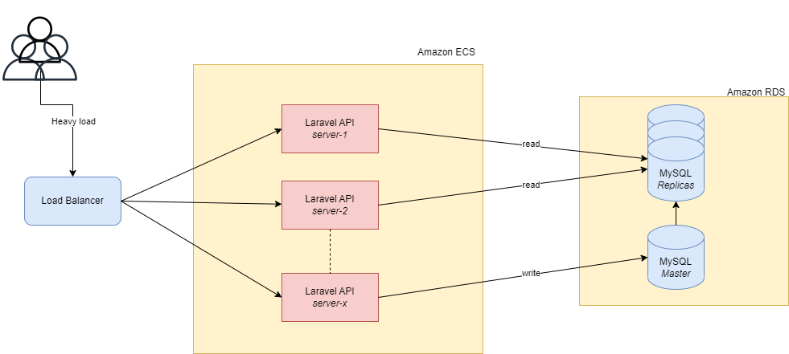

## About
An API for managing EV charging companies and charging stations.

All the API endpoints and their usage can be consulted under 

[http://localhost/docs](https://pages.github.com/).

## Getting started

### Prerequisites
- Docker

### Steps
- clone the 'main' branch using the following command
    ```
    git clone https://github.com/MihaiNicolae1/laravel-api.git
    ```
- in the newly created directory, run from the terminal
    ```
    docker-compose up -d
    ```
## Scalability

The following architecture should be implemented in cloud to ensure scalability of the app


